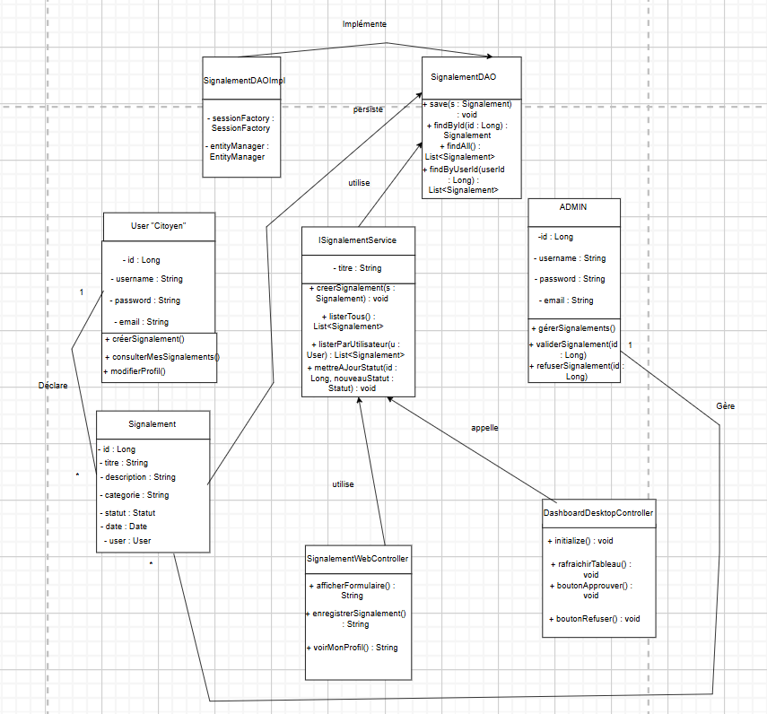

<table style="width: 100%; border: none;">
  <tr>
    <td width="70%" style="vertical-align: middle;">
      <h1>SmartCity Reporter : Système Hybride de Gestion Urbaine</h1>
      <blockquote>
        <strong>Réalisé par :</strong> Marwa El Omari Alaoui<br>
        <strong>Encadré par :</strong> M. Abderrahim Larhlimi<br>
        <strong>Établissement :</strong> EMSI Casablanca<br>
        <strong>Année Universitaire :</strong> 2025-2026
      </blockquote>
    </td>
    <td width="30%" align="center" style="vertical-align: middle;">
      
    </td>
  </tr>
</table>

---

##  Remerciements

Au terme de ce projet, je tiens à exprimer ma profonde gratitude et mes sincères remerciements à toutes les personnes qui ont contribué, de près ou de loin, à la réussite de ce travail.

Mes remerciements s'adressent tout d'abord à mon professeur, Monsieur Abderrahim Larhlimi, pour sa disponibilité, sa rigueur scientifique et la qualité de ses enseignements en Java Avancé. Ses précieux conseils techniques et ses orientations stratégiques m’ont permis de mener à bien la conception de cette architecture hybride et d'approfondir mes connaissances en développement logiciel.

Je tiens également à remercier l’administration de l’EMSI Casablanca pour le cadre académique stimulant et les ressources mises à notre disposition tout au long de notre cursus.

Enfin, j'adresse une pensée particulière à ma famille et à mes proches pour leur soutien inconditionnel, leurs encouragements constants et leur patience, qui ont été une source de motivation indispensable pour l'aboutissement de ce projet de fin de module.

---

## Table des Matières

1. [Introduction Générale](#introduction-générale)
2. [Partie I : Analyse et Conception](#partie-i--analyse-et-conception)
3. [Partie II : Environnement Technique](#partie-ii--environnement-technique)
4. [Partie III : Architecture et Implémentation](#partie-iii--architecture-et-implémentation)
5. [Partie IV : Interface Utilisateur et Tests](#partie-iv--interface-utilisateur-et-tests)
6. [Conclusion et Perspectives](#conclusion-et-perspectives)

---

## 1. Introduction Générale

**SmartCity Reporter** est une application hybride permettant aux citoyens de signaler des incidents urbains (éclairage, voirie, propreté) et aux autorités de gérer ces signalements via une interface Web ou un module Desktop JavaFX.

- **Contexte** : Modernisation de la communication citoyenne.
- **Problématique** : Lenteur de traitement des incidents et besoin de centralisation des données.
- **Objectifs** : Offrir un suivi en temps réel (Web) et une administration robuste (Desktop).

---

## Partie I : Analyse et Conception

### 2.1 Spécification des besoins

- **Besoins Fonctionnels** : Authentification, création de signalements, gestion des statuts (En attente/Approuvé).
- **Besoins Non-Fonctionnels** : Sécurité, ergonomie (Bootstrap 5/Glassmorphism), et temps de réponse rapide.

### 2.2 Conception UML (Diagramme de Classes)



Le diagramme de classes représente l'épine dorsale de l'application SmartCity Reporter. Il illustre l'organisation des données, les comportements du système et les relations entre les différents composants techniques.

- **Gestion des Utilisateurs** : Le système distingue deux types d'utilisateurs principaux : le `User` "Citoyen" et l'`ADMIN`. Le Citoyen est responsable de la création des alertes via la méthode `créerSignalement()`, tandis que l'Admin dispose des privilèges de modération pour traiter ces alertes avec les méthodes `validerSignalement()` et `refuserSignalement()`.

- **Logique Métier et Multiplicités** : Une relation d'association directe lie les utilisateurs aux incidents. Un Citoyen peut déclarer plusieurs signalements (multiplicité 1..*), et chaque signalement est ensuite pris en charge et géré par l'Administrateur (multiplicité 1) pour assurer le suivi urbain.

- **Architecture en Couches (N-Tier)** :
    - **Couche Présentation** : Les contrôleurs `SignalementWebController` (Interface Web Citoyen) et `DashboardDesktopController` (Interface JavaFX Admin) appellent les services métiers pour exécuter les actions utilisateur.
    - **Couche Service** : L'interface `ISignalementService` centralise la logique de l'application. Elle reçoit les requêtes des contrôleurs et utilise la couche DAO pour manipuler les données.
    - **Couche DAO (Data Access Object)** : Elle assure la persistance des informations. L'interface `SignalementDAO` définit les opérations de base (save, find, update), qui sont concrètement implémentées par `SignalementDAOImpl` pour communiquer avec la base de données MySQL via Hibernate.

### 2.3 Conception de la Base de Données (MLD)

*(Description de la structure de la base de données)*

---

## Partie II : Environnement Technique

- **Langage** : Java (JDK 17/21).
- **Framework** : Spring Boot (Back-end) et JavaFX (Desktop).
- **IDE** : IntelliJ IDEA.
- **Base de données** : MySQL avec Hibernate pour le mapping objet-relationnel.
- **Gestionnaire de build** : Maven pour la gestion des dépendances (`pom.xml`).

---

## Partie III : Architecture et Implémentation

### 4.1 Architecture Logicielle Hybride

L'application adopte une architecture hybride :

- `ma.emsi.model` : Contient les entités User, Signalement et les Enums.
- `ma.emsi.dao` : Gère les interactions avec MySQL (SignalementDAOImpl).
- `ma.emsi.service` : Centralise la logique métier (ISignalementService).
- `ma.emsi.ui` : Gère les interfaces Web (Thymeleaf) et Desktop (JavaFX).

<br>

L'application est découpée en packages suivant l'architecture en couches :

- `com.examen.signalement.model` : Objets POJO mappés par Hibernate.
- `com.examen.signalement.dao` : Gestion du SQL et persistance.
- `com.examen.signalement.service` : Logique métier (Streams, tris).
- `com.examen.signalement.javafx` : UI Desktop native.

<br>

L'application SmartCity Reporter repose sur une **architecture hybride** unique combinant deux interfaces complémentaires :

```
┌─────────────────────────────────────────────────────────────────────────┐
│                        SMARTCITY REPORTER                               │
│                     Architecture Hybride                                │
├─────────────────────────────────┬───────────────────────────────────────┤
│       🌐 INTERFACE WEB          │       🖥️ INTERFACE DESKTOP           │
│                                 │                                       │
│  • Accès via navigateur         │  • Application JavaFX native          │
│  • Pour les citoyens            │  • Pour les administrateurs           │
│  • Responsive (mobile/tablet)   │  • Gestion sur poste fixe             │
│                                 │                                       │
│  Fichiers clés :                │  Fichiers clés :                      │
│  └── SignalementWebController   │  └── DesktopLauncher.java             │
│  └── Templates Thymeleaf        │  └── DashboardView.java               │
│                                 │  └── SmartCityJavaFxApp.java          │
└─────────────────────────────────┴───────────────────────────────────────┘
```

### 4.2 Design Patterns & Concepts Avancés

- **DAO (Data Access Object)** : Isolation complète du code JDBC/Hibernate.
- **Singleton** : Instance unique de connexion à la base de données.
- **Streams & Collections** : Filtrage performant des listes de signalements.
- **Exceptions** : Utilisation de `SignalementNotFoundException` pour la robustesse.
- **Threads** : Gestion du port 8080 (Spring) et du Thread UI (JavaFX) en parallèle.

### 4.3 Extraits de code clés

Nous avons implémenté le pattern DAO (Data Access Object) pour isoler le code SQL. L'interface SignalementDAO définit les opérations, tandis que SignalementDAOImpl utilise Hibernate pour les réaliser.

#### Exemple : Implémentation du pattern DAO
```java
public class SignalementDAOImpl implements SignalementDAO {
    @Override
    public Signalement save(Signalement entity) {
        Transaction transaction = null;
        try (Session session = HibernateUtil.getSessionFactory().openSession()) {
            transaction = session.beginTransaction();
            session.save(entity);
            transaction.commit();
            return entity;
        } catch (Exception e) {
            if (transaction != null) transaction.rollback();
            throw new DataAccessException("Error saving Signalement", e);
        }
    }

    @Override
    public List<Signalement> findAll() {
        try (Session session = HibernateUtil.getSessionFactory().openSession()) {
            return session.createQuery("from Signalement", Signalement.class).list();
        }
    }
}
```

#### Exemple : Logique Métier (Service)
```java
@Service
public class SignalementServiceImpl implements SignalementService {
    @Override
    public void modifierStatut(Long id, StatutSignalement nouveauStatut) {
        Signalement signalement = signalementDAO.findById(id);
        if (signalement != null) {
            signalement.setStatut(nouveauStatut);
            signalementDAO.update(signalement);
        }
    }
}
```

---

## Partie IV : Interface Utilisateur et Tests

### Présentation des interfaces

- **Espace Citoyen (Web)** : Interface responsive pour le dépôt de signalements.
    - *> Interface moderne avec formulaire de signalement et carousel d'images urbaines*
    - *> Suivi en temps réel avec badges de statut colorés*
- **Tableau de bord (JavaFX)** : Interface Desktop avec TableView pour la modération.
    - *> Vue complète des signalements avec actions de modération*
    - *> Application native avec TableView interactive*

### Scénarios de Test

- **Test Nominal** : Un signalement créé sur le Web apparaît instantanément sur le Desktop.
- **Test d'erreur** : Gestion du port 8080 occupé via la commande `taskkill /F /IM java.exe`.

---

## Conclusion et Perspectives

### Bilan Technique

Le projet **SmartCity Reporter** constitue une **solution logicielle robuste, sécurisée et intégrée** pour la modernisation de la gestion citoyenne. En combinant la puissance du framework **Spring Boot** et une **architecture hybride**, cette plateforme répond aux exigences réelles d'une ville intelligente. L'architecture hybride offre une flexibilité totale.

### Perspectives

- Intégration d'une cartographie dynamique.
- Système de notifications Push pour informer les citoyens de l'avancement de leur signalement.

### ✅ Points Forts du Projet

| Aspect | Description |
|--------|-------------|
| **Architecture Hybride** | La coexistence d'une interface Web responsive et d'un module Desktop JavaFX (via `DesktopLauncher.java`) offre une flexibilité d'usage unique |
| **Gestion des Rôles** | Système d'authentification différencié garantissant un accès sécurisé pour chaque utilisateur |
| **Expérience UI/UX** | Thymeleaf, Bootstrap 5 et design Glassmorphism pour une navigation intuitive |
| **Fiabilité Technique** | Persistance MySQL et logique métier structurée pour un suivi rigoureux |

### 🌟 Vision

Ce projet pose les bases d'une **ville intelligente** où la technologie simplifie la communication entre l'administration et ses habitants, garantissant ainsi un environnement urbain **mieux entretenu et plus réactif**.

---

<div align="center">

**🏙️ SmartCity Reporter**

*Solution hybride Web + Desktop pour l'innovation urbaine*

**EMSI Casablanca - 2026**

---

Made with ❤️ by **Marwa El Omari Alaoui**

</div>
